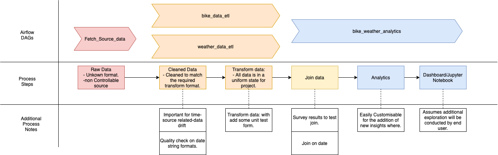

# bike_weather_project

## Introduction:
 #### - Project Business Logic
 Hypothetical product owner has requested, a way to view nyc bike trip data with the daily weather. Currently their 
 interest is only related to the month of May in 2016.
- Bike Data Source: https://www.citibikenyc.com/system-data
- weather data source: https://meteostat.net/en (updated their website very cool UI)

The project owner would like to have access a table containing the daily average count of rides, the average ride 
duration, and weather. Both in excel format and via a Juypter Notebook.

## Project Plan Breakdown:
Required: 
* Docker  -> https://www.docker.com/
* Meteostat API Key -> https://meteostat.net/en (For fetch_source_data/fetch_data_sources_dag.py). Test data set found 
in "spark/resources/data".


#### Environment:<br />
Initial environment set up from: https://github.com/cordon-thiago/airflow-spark
- Apache Airflow ( plus postgres ):  postgres:9.6 <br />
   ```      $ cd docker/docker-airflow/      ```
   ```      $ docker build --rm  -t docker-airflow-spark:latest . ```
- Apache Spark: bitnami/spark:spark:2.4.5-debian-10-r75 <br />
   ```     $ docker pull bitnami/spark:spark:2.4.5-debian-10-r75  ``` 
- Juypter Notebook: jupyter/pyspark-notebook:latest<br />
    ```    $ docker pull jupyter/pyspark-notebook:latest  ``` 
- Mongodb: bitnami/mongodb:latest <br />
   ```     $ docker pull bitnami/mongodb:latest ``` 


## How To Run:

1) Install Docker and download/create images for the project. (See above for commands).

2) Compose docker images:
      ```      $ cd docker/     ```
      ```      $ docker-compose up    ```
3) Accessing Containers
 
| Container     | Port access   | 
| ------------- |:-------------:| 
| airflow       | http://localhost:8282 | 
| spark master  | http://localhost:8181    |   
| Jupyter Notebook* |  *see note    |   


* Jupyter Notebook needs a token to access:
    ```   $ docker logs -f docker_jupyter-spark_1   ```  
Logs output will provide link with token to access the juypter notebook. 

Common sources of trouble:
- Java version.
- MongoDB connector to spark.
- pyspark version.
## Data Pipelines:



## File Structure
  - Airflow
     - dag_name
       - operators
       - scripts
  - docker files
  - spark
     - spark resources
  - notebooks_testing
   
## Project Planning thoughts/ Alternatives:

- Data Pipeline Orchestration: 
    - Apache Airflow
    - Apache NiFi
    - Apache Oozie
 
- Data Handling
    - Apache Spark.


- Data Storage
    - Mongodb
    - Postgresql
    